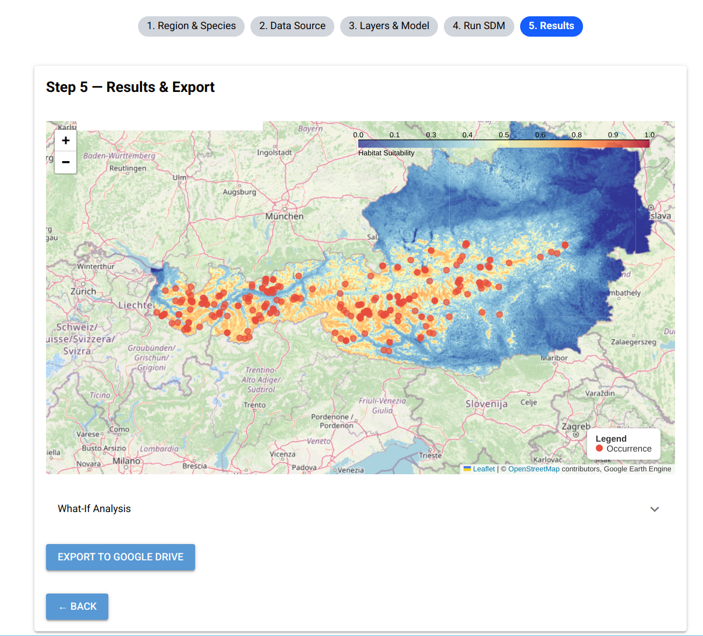

# SDM-Toolbox

An interactive desktop application for species distribution modeling (SDM) using Google Earth Engine (GEE), GBIF occurrence data, and scikit-learn. Guided 5-step workflow — no coding required.



---

## What it does

- Fetch species occurrence records from GBIF with a live autocomplete search
- Load environmental predictor layers from Google Earth Engine (climate, terrain, land cover, etc.)
- Train Random Forest, Maxent, or Embedding models on GEE infrastructure
- Display a habitat suitability map, feature importances, and a what-if exploration panel
- Export results to Google Drive

---

## Prerequisites

| Requirement | Notes |
|---|---|
| Python 3.11–3.13 | Tested on 3.11 and 3.12 |
| [`uv`](https://docs.astral.sh/uv/) | Package manager — replaces pip/venv |
| Google Earth Engine account | Free for research; requires a Cloud project |
| GBIF account | Optional; needed for Deep Dive mode only |

---

## Google Earth Engine Setup

1. **Create a Google account** if you do not already have one.

2. **Sign up for Google Earth Engine** at [earthengine.google.com](https://earthengine.google.com). Select "Register a Noncommercial or Commercial Cloud project" and follow the prompts. Approval is usually instant for research use.

3. **Create a Google Cloud project** (or use the one created during GEE sign-up):
   - Go to [console.cloud.google.com](https://console.cloud.google.com)
   - Create a new project (or select an existing one)
   - Enable the **Earth Engine API**: navigate to *APIs & Services → Library*, search for "Earth Engine API", and click **Enable**

4. **Find your GEE project ID**: in the Cloud Console, your project ID appears in the top bar next to the project name (format: `my-project-123456`). You will enter this ID on first launch.

5. **Authenticate**: the app will prompt you to authenticate via browser OAuth on first launch. Alternatively, run:
   ```bash
   earthengine authenticate
   ```

---

## Installation

```bash
git clone https://github.com/basnied/sdm-toolbox.git
cd toolbox
uv sync
```

This creates a virtual environment and installs all dependencies automatically.

---

## Running the app

```bash
uv run python main.py
```

On first launch a dialog asks for your **GEE Cloud project ID**. The ID is saved to `~/.sdm-toolbox/config.json` and pre-filled on subsequent runs.

---

## Workflow (5 steps)

| Step | What you do |
|---|---|
| **1 Region** | Search for a species by name (GBIF autocomplete), select a country, and optionally restrict the analysis to a NUTS-2 region |
| **2 Data** | Choose a data mode (see below) and fetch occurrence records; preview on map |
| **3 Model** | Select GEE predictor layers and configure the model type and hyperparameters |
| **4 Run** | Execute the SDM pipeline; progress bar and accuracy metric displayed |
| **5 Results** | Inspect the habitat suitability map, feature importances, what-if panel; export to Google Drive |

---

## Data modes

| Mode | Records | Year filter | Model backend |
|---|---|---|---|
| **Explore** | ≤ 300 (fast) | No | GEE server-side RF / Maxent |
| **Deep Dive** | Paginated GBIF (thousands) | Yes | sklearn RF / Maxent, map applied via GEE |
| **Own Dataset** | Your GBIF download (dataset key) | — | GEE server-side RF / Maxent |

Deep Dive requires a GBIF username and password (entered in the app).

---

## SDM models

| Model | Notes |
|---|---|
| **Random Forest** | Default; provides feature importances |
| **Maxent** | Presence-only maximum entropy model via GEE |
| **Embedding** | Cosine similarity against Google Satellite Embedding V1; no training data needed |

Background pseudo-absences are drawn from `assets/background_data.csv`. County selection (NUTS-2) affects the **classification area** only — GBIF records are always fetched country-wide.

---

## Advanced: Jupyter notebook

For scripted workflows and full parameter control, use the bundled notebook:

```bash
jupyter notebook sdm_workflow.ipynb
```

The notebook shares the same core logic (`toolbox/utils.py`) as the desktop app.

---

## Project structure

```
toolbox/
├── main.py                   # Entry point
├── app/
│   ├── state.py              # AppState dataclass
│   ├── map_server.py         # Folium → iframe helper
│   ├── steps/                # step1_region … step5_results
│   └── services/             # gee_service, gbif_service, sdm_service
├── toolbox/
│   ├── utils.py              # Shared core logic (do not modify)
│   └── stat_functions.py
├── tests/
│   ├── test_services/        # test_state.py
│   └── test_utils/           # test_aoi, test_background, test_compute_sdm
├── assets/                   # NUTS GeoJSONs, background_data.csv
└── sdm_workflow.ipynb        # Advanced notebook interface
```

---

## Citation / License

This tool was developed as part of a Master's thesis. If you use it in your research, please cite accordingly. License: MIT.
